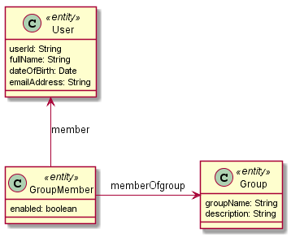
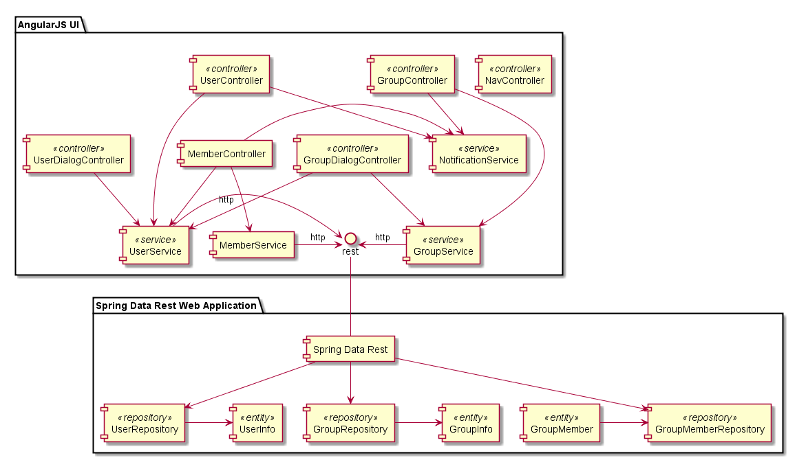
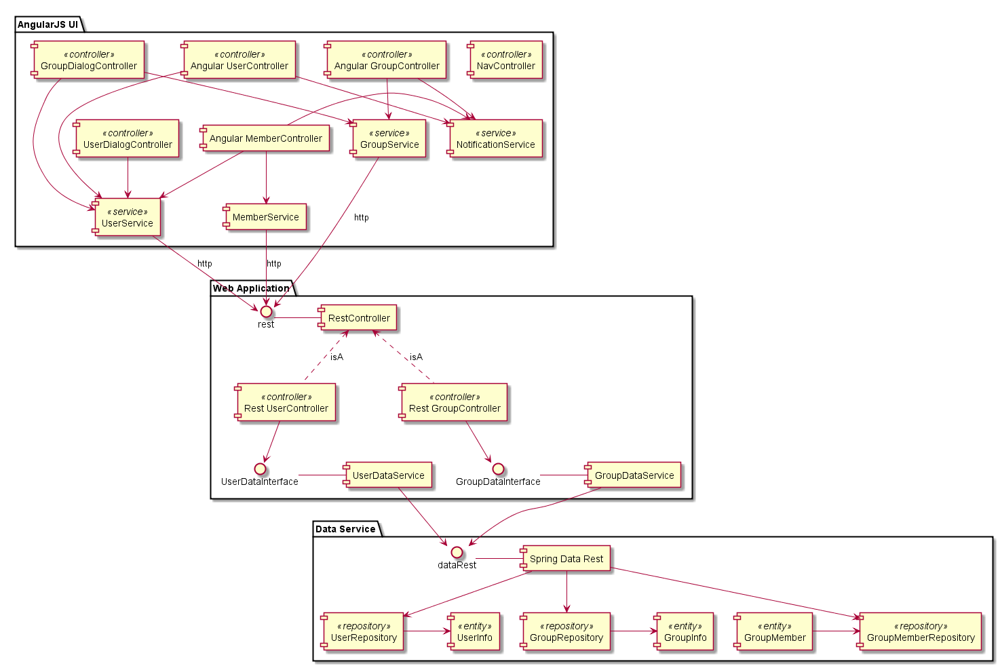

= Demonstration of AngularJS with Spring Data Rest

== Introduction

The Spring Data Rest backend is based on some demonstrations developed previously.
I created this demonstration in order to learn AngularJS and decided to publish this because it left like most sample projects fall short.
This project shows how far you can get by using Spring Data Rest without adding any customer controller or service code.

== Technologies Used

* link:http://projects.spring.io/spring-boot[Spring Boot] - 1.3.3
* link:http://projects.spring.io/spring-data-jpa[Spring Data JPA] - 1.9.4
* link:http://projects.spring.io/spring-data-rest[Spring Data Rest] - 2.4.4
* link:http://docs.spring.io/spring/docs/current/spring-framework-reference/html/mvc.html[Spring Web MVC] - 4.2.5
* link:https://angularjs.org[AngularJS] - 1.5.3
* link:https://material.angularjs.org[Angular Material] - 1.0.6
* link:https://github.com/daniel-nagy/md-data-table[Angular Material Design Data Table] - 0.10.3
* link:https://github.com/wallin/angular-gravatar[Angular Gravatar] - 0.4.1
* link:https://github.com/google/material-design-icons[Material Design Icons] - 2.2.0

== Design decisions

Some of the elements may feel contrived but they were done as an exercise.
As an example the user of Thymeleaf templates may not be required in the days of single page applications.
There are going to be times when some elements of an application is not part of a single page and then it will be useful to have a template mechanism that provides for common layouts.
You may also need to build fragments that need to live in an unknown application. The application context path is not know when you create the html but you want the application to serve content based on the actual application context path.
Thymeleaf provides for all the functions.

== Persistent Model

This diagram describes the entities of the persistent model.



== Components

This diagram describe the various components involved.
As a perfectly accurate UML component model this should have a lot more interfaces.
A lot of the complexity has been collapse to show the essential relationships between the system components.



== Refined Component Model



== ToDo
* [X] Delete User(s) with prompt indicating impact.
* [X] Validate User input in dialog
* [X] Delete Group(s) with prompt indicating impact.
* [X] Validate Group input
* [X] Group Members

== Running

Checkout the project:
`git clone https://github.com/corneil/spring-data-rest-angular-demo.git`

=== Initial Project
To run initial project:
```
./gradlew :initial:bootRun
```
link:http://localhost:8080[]

=== Data Service
To run data-service project:
```
./gradlew :data-service:bootRun
```
link:http://localhost:8888[]

To run web application:
```
./gradlew :web-app:bootRun
```
=== Local Web Application
link:http://localhost:8080[]

=== Swagger UI
link:http://localhost:8080/swagger-ui.html[]

++++
<a href="https://www.paypal.com/cgi-bin/webscr?cmd=_donations&business=corneil%2eduplessis%40gmail%2ecom&lc=ZA&item_name=Corneil%20du%20Plessis&currency_code=USD&bn=PP%2dDonationsBF%3abtn_donateCC_LG%2egif%3aNonHosted">

</a>
++++